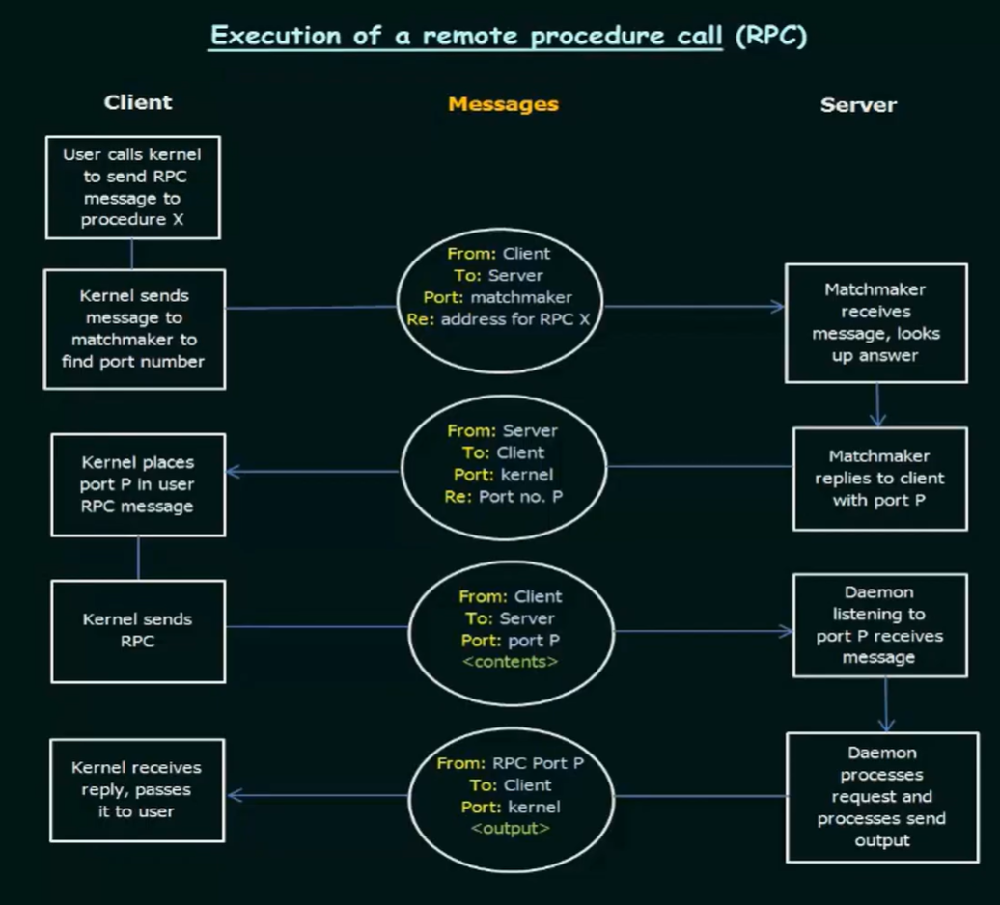

- Difference of data representation between client and server. Resolved by machine independent representation of data
- External data representation (XDR)
- Requests are executed exactly once, this is implemented by acknowledgement
- Rendezvous daemon/matchmaker, finds port number of server and provides to remote client

